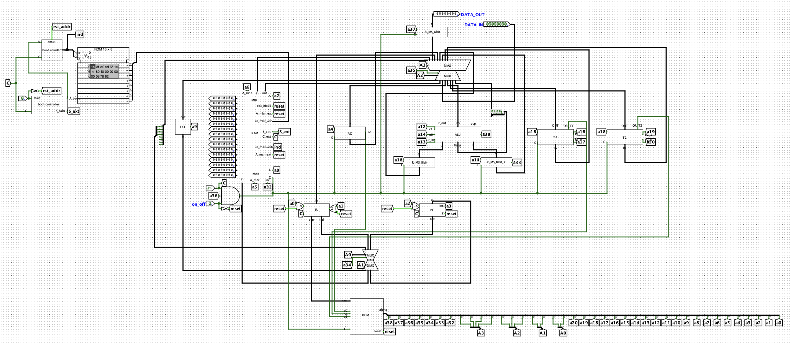
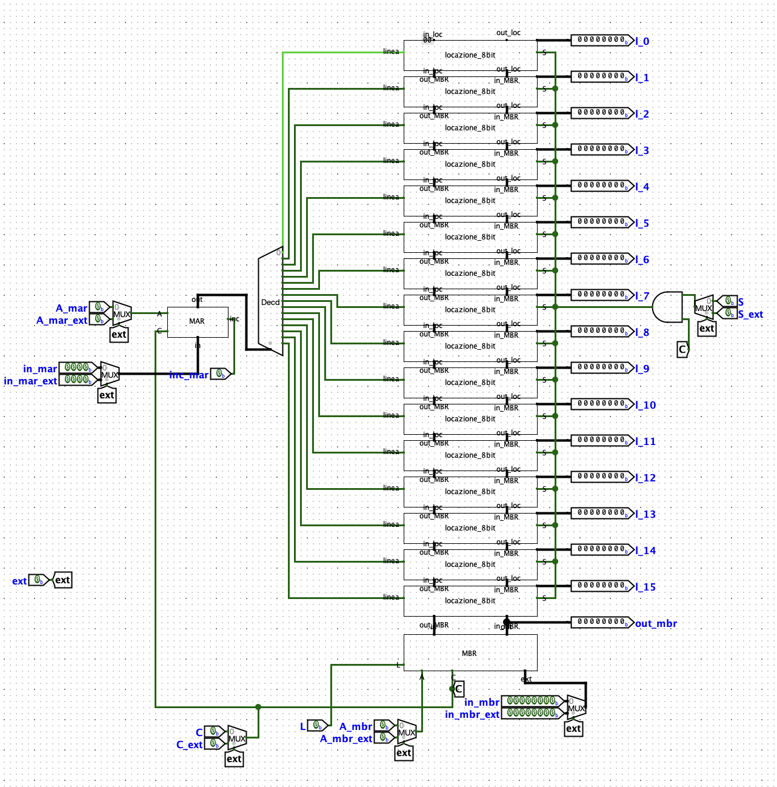
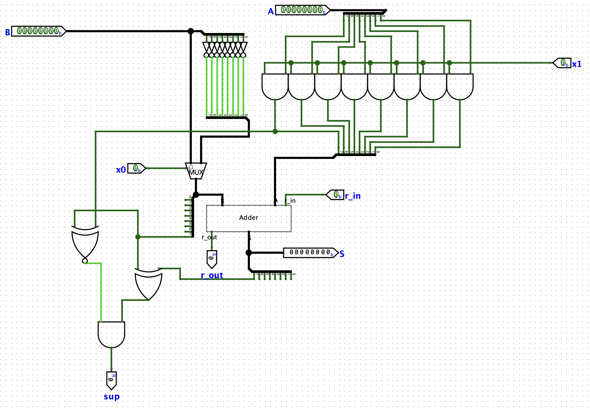
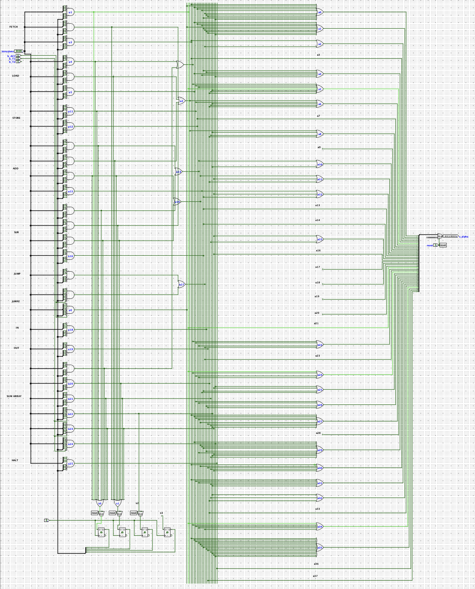

# 8-bit Accumulator CPU

Fully functional accumulator CPU designed circuit by circuit using only logic gates, with the exception of MUXs, DEMUXs, and decoders (simple but necessary circuits of various sizes, which would have been repetitive and unnecessary to design individually).

The circuits are connected to each other via an 8-bit data bus and a 4-bit address bus. Both buses use a MUX to select the input line and a DEMUX to select the output line.

Machine power is managed by the **on_off** pin:
* When on_off is **active**, it enables the clock signal to all CPU circuits, starting execution.
* When on_off is **inactive**, it stops the clock, resets the Instruction Register and Program Counter to prepare them for running a new program, and automatically switches the machine to External Mode to allow manual RAM programming.

---

## Main Circuits

### RAM
It features 16 locations of 8 bits each and is managed by 2 support registers: **MAR** (for the address) and **MBR** (for the data). If the **S** pin is active, it writes the data stored in the MBR to the RAM location specified by the MAR. If the **L** pin is active, it reads the location specified by the MAR from RAM and copies its content into the MBR.

When the on_off pin is deactivated, **External Mode** is entered automatically. In this state, the RAM can be programmed manually: MAR and MBR are enabled, the desired address and instruction are set, and a pulse is applied to the clock (RAM-specific) and write pins.

### ALU
It features 3 control bits: **x0** negates operand B, **x1** adds operand A to operand B, and **r_in** increments by 1. Thanks to these signals, operations such as A+B, A-B, B, -B, and NOT(B) can be executed.

### Control Unit
It is implemented via a ROM memory and uses microprogrammed logic composed of minterms. Based on the instruction, external signals, and the internal state of the machine, it generates the necessary control signals to execute each individual microstep.

---

## Instructions

| Opcode | Instruction | Description |
| :---: | :--- | :--- |
| **0000** | **FETCH** | Loads the next instruction into the Instruction Register. |
| **0001** | **LOAD X** | Loads the data at RAM address X into the accumulator. |
| **0010** | **STORE X** | Saves the data in the accumulator to RAM address X. |
| **0011** | **ADD X** | Adds the data at RAM address X to the value in the accumulator and stores the result in the accumulator. |
| **0100** | **SUB X** | Subtracts the data at RAM address X from the value in the accumulator and stores the result in the accumulator. |
| **0101** | **JUMP X** | Jumps to the instruction located at RAM address X. |
| **0110** | **JUMPZ X** | Jumps to the instruction at RAM address X only if the accumulator contains 00000000. |
| **0111** | **IN** | Reads the data supplied to the DATA_IN input pin and loads it into the accumulator. |
| **1000** | **OUT** | Sends the data in the accumulator to output, retains it in a dedicated register, and makes it visible on the DATA_OUT output pin. |
| **1001** | **SUM ARRAY X** | Given an array of N elements, where N is specified at RAM address X and the array starts at address X+1, it calculates the sum of all elements in the array and stores the final result in the accumulator. |
| **1111** | **HALT** | Halts program execution by blocking the clock signal to the circuits. |

---

**Note:** The machine also integrates other components that are currently unused (such as registers with increment/decrement and shift capabilities, or direct connections between the two buses) which can be used to implement new instructions in the future.
