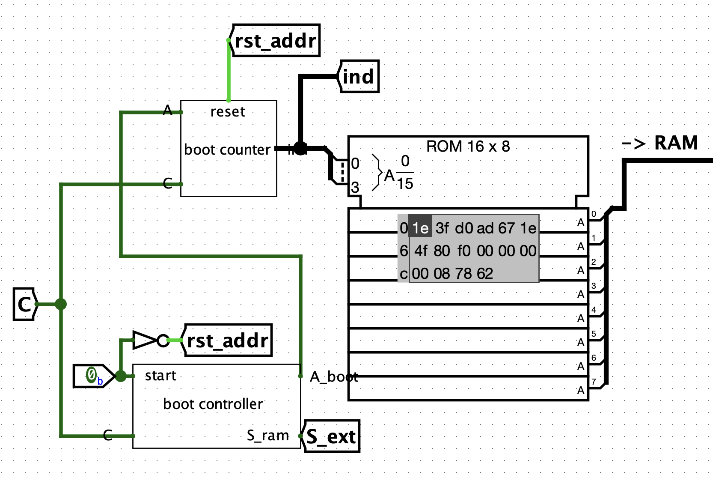
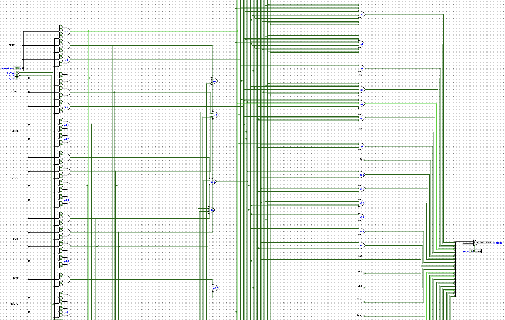
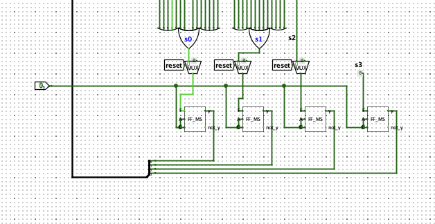

# 8-bit Accumulator CPU

Fully functional accumulator CPU designed circuit by circuit using only logic gates, with the exception of MUXs, DEMUXs, decoders (simple but necessary circuits of various sizes, which would have been repetitive and unnecessary to design individually), and the Logisim ROM required to load instructions from an external file (in hexadecimal) to be written into RAM.

The circuits are connected to each other via an 8-bit data bus and a 4-bit address bus. Both buses use a MUX to select the input line and a DEMUX to select the output line.

Programs must be written in a text file and processed by a Python script acting as an assembler before being copied into the Logisim ROM and transferred to RAM. 
Details can be found here: [Assembler README](assembler/README.md).

Machine power is managed by the **on_off** pin:
* When on_off is **active**, it enables the clock signal to all CPU circuits, starting execution.
* When on_off is **inactive**, it stops the clock, resets the Instruction Register and Program Counter to prepare them for running a new program, and automatically switches the machine to **External Mode**. In this state, the content of the Logisim ROM can be transferred to RAM by activating the **start** pin.

---

## Main Circuits

### RAM
It features 16 locations of 8 bits each and is managed by 2 support registers: **MAR** (for the address) and **MBR** (for the data). If the **S** pin is active, it writes the data stored in the MBR to the RAM location specified by the MAR. If the **L** pin is active, it reads the location specified by the MAR from RAM and copies its content into the MBR.

When the machine is turned off with the on_off pin deactivated, External Mode is entered automatically. In this state, the content of the Logisim ROM can be copied into RAM by activating the start pin.

### ALU
It features 3 control bits: **x0** negates operand B, **x1** adds operand A to operand B, and **r_in** increments by 1 (carry-in). Thanks to these signals, operations such as A+B, A-B, B, -B, and NOT(B) can be executed.

Control bit configurations that produced low-utility results were replaced with dedicated operations, specifically: **A AND B** (`x0 = 0`, `x1 = 1`, `r_in = 1`) and **A OR B** (`x0 = 1`, `x1 = 1`, `r_in = 0`).

The ALU is also equipped with a **Flags Register** that updates upon executing `ADD`, `SUB`, `AND`, or `OR` instructions. It consists of 4 bits corresponding to: **Overflow**, **Carry**, **Sign**, and **Zero**.

### Boot System
Handles the transfer of data from the Logisim ROM to the RAM and consists of 2 circuits: the **Boot Counter**, which holds and increments the current memory address to write to, and the **Boot Controller**, which manages the RAM write signals and address incrementation.

### Control Unit
It is microprogrammed and composed of minterms. Based on the instruction, external signals, and the internal state of the machine, it generates the necessary control signals to execute each individual microstep.

With each microstep of an instruction, the internal state of the control unit changes to transition to the next microstep.

---

## Instruction Set

| Instruction | Mnemonic | Opcode | Description |
| :--- | :---: | :---: | :--- |
| **FETCH** | — | **0000** | Loads the next instruction into the Instruction Register. |
| **LOAD X** | `LDA` | **0001** | Loads the data at RAM address X into the accumulator. |
| **STORE X** | `STA` | **0010** | Saves the data in the accumulator to RAM address X. |
| **ADD X** | `ADD` | **0011** | Adds the data at RAM address X to the value in the accumulator and stores the result in the accumulator. |
| **SUB X** | `SUB` | **0100** | Subtracts the data at RAM address X from the value in the accumulator and stores the result in the accumulator. |
| **JUMP X** | `JMP` | **0101** | Jumps to the instruction located at RAM address X. |
| **JUMPZ X** | `JZ` | **0110** | Jumps to the instruction at RAM address X only if the accumulator contains `00000000`. |
| **IN** | `IN` | **0111** | Reads the data supplied to the `DATA_IN` input pin and loads it into the accumulator. |
| **OUT** | `OUT` | **1000** | Sends the data in the accumulator to output, retains it in a dedicated register, and displays it on `DATA_OUT`. |
| **SUM ARRAY X** | `SMA` | **1001** | Given an array of N elements (where N is specified at RAM address X and the array starts at X+1), calculates the sum of all elements and stores the result in the accumulator. |
| **AND X** | `AND` | **1010** | Performs a bitwise logical AND between the accumulator data and the data at RAM address X, storing the result in the accumulator. |
| **OR X** | `OR` | **1011** | Performs a bitwise logical OR between the accumulator data and the data at RAM address X, storing the result in the accumulator. |
| **LOAD IMMEDIATE X** | `LDI` | **1100** | Loads the immediate value X directly into the accumulator without sign extension. |
| **LOAD FLAGS** | `LDF` | **1101** | Loads the Flags Register into the accumulator (the first 4 bits are empty, followed by Overflow, Carry, Sign, and Zero). |
| **HALT** | `HLT` | **1111** | Halts program execution by blocking the clock signal to the circuits. |
